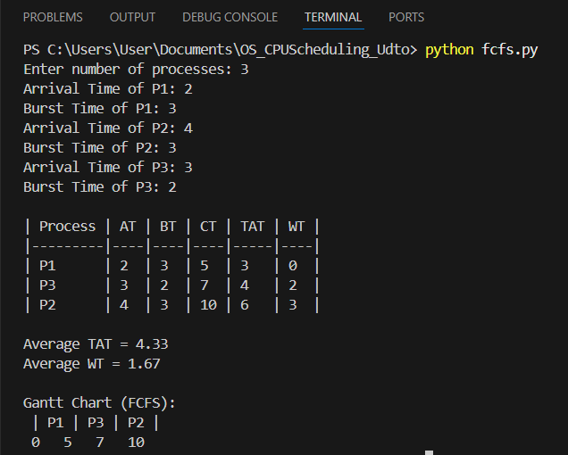
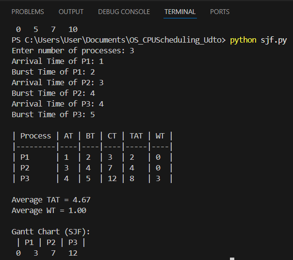
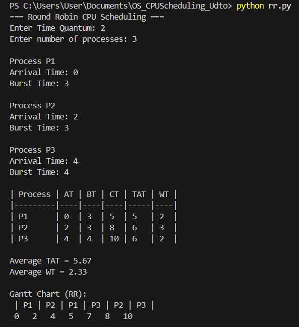

# OS_CPUScheduling_Udto

This repository contains implementations of three CPU Scheduling algorithms:
- **FCFS (First Come First Serve)**
- **SJF (Shortest Job First)**
- **RR (Round Robin)**

Each program is written in **Python** and demonstrates how different CPU scheduling algorithms handle process management, including:
- Arrival Time
- Burst Time
- Completion Time
- Turnaround Time (TAT)
- Waiting Time (WT)
- Gantt Chart visualization

---

## 📘 Algorithm Explanations

### 1. FCFS (First Come First Serve)
- Processes are executed in the order they arrive.
- Non-preemptive scheduling.
- Simple but may cause **Convoy Effect** (slow processes delay others).

**Formula:**

# TAT = CT - AT
# WT = TAT - BT

---

### 2. SJF (Shortest Job First)
- Executes the process with the **shortest burst time** first.
- Reduces average waiting time.
- Non-preemptive version used here.

**Formula:**

# TAT = CT - AT
# WT = TAT - BT

---

### 3. RR (Round Robin)
- Each process is assigned a fixed **time quantum**.
- Preemptive: processes are paused and resumed in a circular order.
- Balances response time and fairness.

**Formula:**

# TAT = CT - AT
# WT = TAT - BT


---

## 🧩 Sample Inputs and Outputs

### FCFS Output


---

### SJF Output


---

### RR Output


---

## ⏱️ Gantt Charts

| Algorithm | Gantt Chart Example |
|------------|---------------------|
| **FCFS** | P1 → P3 → P2 |
| **SJF** | P1 → P2 → P3 |
| **RR** | P1 → P2 → P1 → P3 → P2 → P3 |

---

## 📂 Repository Structure

## OS_CPUScheduling_Lastname/
│
├── fcfs.py
├── sjf.py
├── rr.py
├── README.md
└── screenshots/
├── fcfs_output.png
├── sjf_output.png
└── rr_output.png

---

## 👩‍💻 How to Run
Run each Python file in your terminal:

```bash
python fcfs.py
python sjf.py
python rr.py
